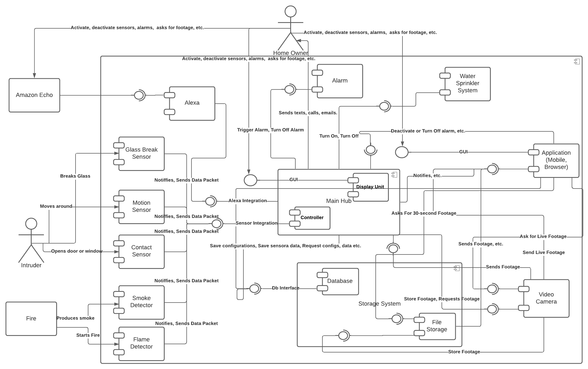
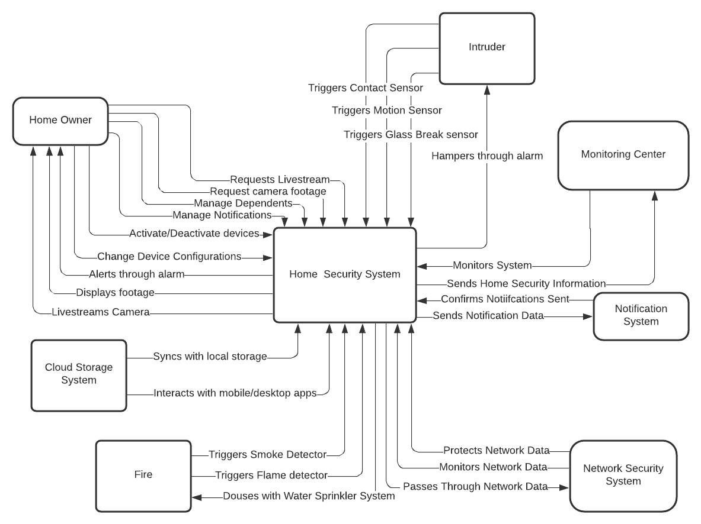
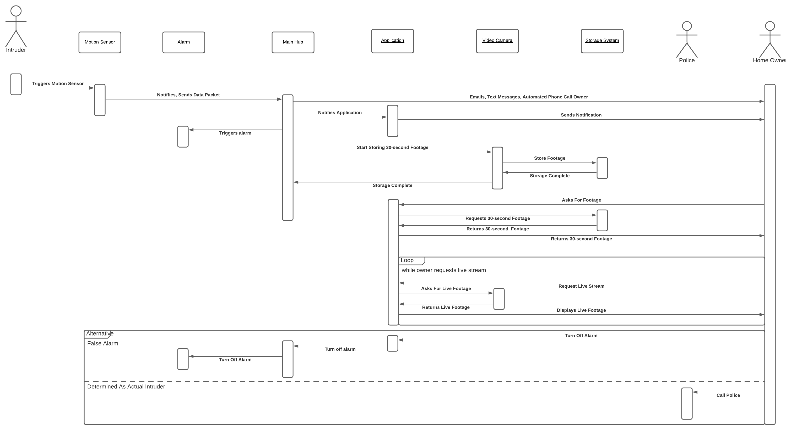
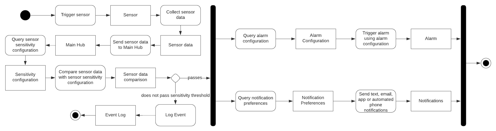

# CSC-8540-SystemDiagrams

Fall 2021 Software Engineering Project - Home Security System

The diagrams describe a home security equipped with intruder detection, fire detection, alarms, a water sprinkler system, a video camera, a companion application, and notification service. In addition to the diagrams, I needed to conduct a presentation on the overall design of the system at the end of the semester.

# Component Diagram

# Context Diagram

# Interaction Diagram

# Behavior Diagram

